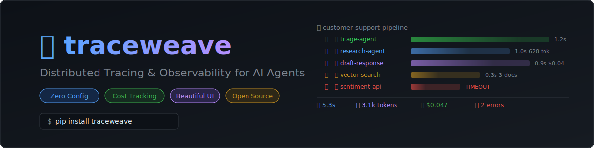

<div align="center">
  <picture>
    
  </picture>

  <h3>모든 결정을 추적. 어떤 에이전트든 디버그. 모든 비용을 관리.</h3>

  [English](README.md) / [简体中文](README_CN.md) / [日本語](README_JA.md) / **한국어** / [Español](README_ES.md)

  [모범 사례][docs-link] · [버그 신고][issues-link] · [기능 요청][issues-link]

  [![][pypi-shield]][pypi-link]
  [![][python-shield]][python-link]
  [![][license-shield]][license-link]
  [![][downloads-shield]][pypi-link]
  [![][test-shield]][test-link]

</div>

---

## 목차

- [👋🏻 traceweave란?](#-traceweave란)
- [🚀 주요 기능](#-주요-기능)
- [🆚 왜 traceweave인가?](#-왜-traceweave인가)
- [🏁 빠른 시작](#-빠른-시작)
- [🔌 통합](#-통합)
- [📊 대시보드](#-대시보드)
- [📁 예제](#-예제)
- [🏗️ 아키텍처](#️-아키텍처)
- [🤝 기여하기](#-기여하기)
- [⭐ Star 히스토리](#-star-히스토리)
- [📄 라이선스](#-라이선스)

---

# 👋🏻 traceweave란?

**traceweave**는 **AI 에이전트를 위한 Datadog** — 멀티 에이전트 AI 시스템을 위해 설계된 오픈소스 분산 트레이싱 & 옵저버빌리티 플랫폼입니다.

**코드 2줄**만 추가하면 에이전트의 모든 동작을 볼 수 있습니다: 모든 LLM 호출, 도구 실행, 판단 — 토큰 수, 비용 추적, 아름다운 시각화와 함께.

```
📍 Trace: customer-support-pipeline  id=a3f2c1d8...
├── ✅ 🔗 customer-support-pipeline     ██████████████████████░░ 5.3s   tokens: 3.1k   cost: $0.05
│   ├── ✅ 🔧 email-reader              █░░░░░░░░░░░░░░░░░░░░░  0.2s   tokens: -      cost: -
│   ├── ✅ 🤖 triage-agent              ████░░░░░░░░░░░░░░░░░░  1.2s   tokens: 704    cost: $0.0004
│   │   ├── ✅ 🧠 classify-email        █░░░░░░░░░░░░░░░░░░░░░  0.2s   tokens: 704    cost: $0.0004
│   │   │        (claude-4-haiku)
│   │   ├── ❌ 🔧 sentiment-api         █░░░░░░░░░░░░░░░░░░░░░  0.4s   ⚠ TIMEOUT
│   │   └── ❌ 🔧 sentiment-api         █░░░░░░░░░░░░░░░░░░░░░  0.4s   ⚠ RETRY FAILED
│   ├── ✅ 🤖 research-agent            ███░░░░░░░░░░░░░░░░░░░  1.0s   tokens: 628    cost: $0.004
│   │   ├── ✅ 🔧 vector-search         █░░░░░░░░░░░░░░░░░░░░░  0.3s   (3 docs, top=0.94)
│   │   ├── ✅ 🔧 sql-query             █░░░░░░░░░░░░░░░░░░░░░  0.2s   (customer: enterprise)
│   │   └── ✅ 🧠 analyze-issue         ██░░░░░░░░░░░░░░░░░░░░  0.6s   tokens: 628    cost: $0.004
│   │            (claude-4-sonnet)
│   ├── ✅ 🤖 resolution-agent          ██░░░░░░░░░░░░░░░░░░░░  0.6s
│   │   ├── ✅ 🔧 rate-limit-override   █░░░░░░░░░░░░░░░░░░░░░  0.4s   (limit: 10K→20K)
│   │   ├── ✅ 🔧 ticket-update         █░░░░░░░░░░░░░░░░░░░░░  0.1s
│   │   └── ✅ 🔧 slack-notify          █░░░░░░░░░░░░░░░░░░░░░  0.1s   (#support-escalations)
│   └── ✅ 🤖 response-agent            ████████░░░░░░░░░░░░░░  2.3s   tokens: 1.7k   cost: $0.047
│       ├── ✅ 🧠 draft-response        ███░░░░░░░░░░░░░░░░░░░  0.9s   tokens: 861    cost: $0.04
│       │        (claude-4-opus)
│       ├── ✅ 🧠 review-response       ███░░░░░░░░░░░░░░░░░░░  1.0s   tokens: 868    cost: $0.007
│       │        (claude-4-sonnet)
│       ├── ✅ 🔧 send-email            █░░░░░░░░░░░░░░░░░░░░░  0.2s
│       └── ✅ 🔧 ticket-update         █░░░░░░░░░░░░░░░░░░░░░  0.2s   (status: resolved)
╰── Summary ───────────────────────────────────────────────────────────────
    ⏱  5.3s │ 🔢 19 spans │ 📊 3,061 tokens │ 💰 $0.047 │ ❌ 2 errors (handled)
```

> 💡 이 트레이스는 [Showcase Demo](examples/showcase_demo.py)로 생성 — 4개 에이전트, 10회 도구 호출, 5회 LLM 호출, 에러 핸들링 & 리트라이가 포함된 완전한 AI 고객 지원 파이프라인. **API 키 불필요.**

---

# 🚀 주요 기능

1. 🎯 **제로 설정 자동 인스트루먼테이션** — `instrument_all()` 한 줄로 OpenAI, Anthropic, LangChain 자동 추적. 호출 코드 변경 불필요.

2. 🤖 **우아한 데코레이터 API** — `@trace_agent`, `@trace_tool`, `@trace_llm` — 한 줄로 어떤 함수든 추적. sync & async 지원.

3. 💰 **토큰 & 비용 추적** — 주요 모델의 토큰 수와 비용 자동 계산. 예산이 어디에 쓰이는지 정확히 파악.

4. 🖥️ **아름다운 시각화** — Rich 터미널 대시보드(TUI) + 다크 테마 웹 대시보드. 스크린샷 가치가 있는 출력.

5. ❌ **에러 트레이싱 & 디버깅** — 완전한 스택 트레이스로 예외 캡처. 어떤 에이전트/도구가 실패했는지 즉시 확인.

6. 📤 **어디든 내보내기** — JSON, Chrome DevTools(`chrome://tracing`) 등. 기존 옵저버빌리티 스택과 통합.

7. 🔗 **무제한 중첩 지원** — `contextvars`를 통한 자동 부모-자식 추적. 수동 컨텍스트 전달 불필요.

8. ⚡ **경량 & 고속** — 순수 Python, ~3K줄, 무거운 의존성 없음. 스팬당 오버헤드 <1ms.

---

# 🆚 왜 traceweave인가?

### 대상 사용자

| 대상 | 역할 | 고충 |
|:-----|:-----|:-----|
| **AI 에이전트 개발자** | LangChain, CrewAI, AutoGen, 커스텀 에이전트 | 에이전트가 뭘 하는지 보이지 않음; 디버깅은 추측 |
| **LLM 애플리케이션 팀** | 여러 LLM 호출이 포함된 프로덕션 AI 앱 | 토큰 비용이 통제 불능 |
| **AI 플랫폼 엔지니어** | 대규모 멀티 에이전트 인프라 운영 | AI 옵저버빌리티 표준 부재 — 기존 APM은 에이전트를 이해 못함 |

### 경쟁사 비교

| 기능 | traceweave | LangSmith | Weights & Biases | OpenTelemetry |
|:-----|:----------:|:---------:|:-----------------:|:-------------:|
| 오픈소스 | ✅ MIT | ❌ 독점 | ❌ 독점 | ✅ Apache-2.0 |
| 에이전트 네이티브 스팬 | ✅ `AGENT`, `TOOL`, `LLM` | ✅ | ⚠️ 범용 | ❌ 범용 |
| 제로 설정 | ✅ `instrument_all()` | ⚠️ SDK 변경 필요 | ❌ 수동 | ❌ 수동 |
| 토큰 & 비용 추적 | ✅ 내장 | ✅ | ⚠️ 부분적 | ❌ 없음 |
| 아름다운 TUI | ✅ Rich 터미널 UI | ❌ 웹만 | ❌ 웹만 | ❌ UI 없음 |
| 셀프호스트/오프라인 | ✅ 100% 로컬 | ❌ 클라우드 필수 | ❌ 클라우드 필수 | ✅ 셀프호스트 |
| 경량 | ✅ ~3K줄, 순수 Python | ❌ 무거운 SDK | ❌ 무거운 SDK | ⚠️ 복잡한 설정 |
| 데코레이터 API | ✅ `@trace_agent` | ❌ | ❌ | ❌ |

> **🎯 traceweave의 포지셔닝:** LangSmith 수준의 에이전트 옵저버빌리티가 필요하지만, 오픈소스이고 셀프호스트이며 벤더 잠김 없음.

---

# 🏁 빠른 시작

### 1. 설치

```bash
pip install traceweave
```

### 2. 코드 인스트루먼트

```python
from agent_trace import tracer, trace_agent, trace_tool
from agent_trace.dashboard.tui import print_trace

@trace_tool("web-search")
def search(query: str) -> list[str]:
    return ["result 1", "result 2"]

@trace_agent("researcher")
def research(topic: str) -> str:
    results = search(topic)
    return f"Found {len(results)} results about {topic}"

# 모든 것을 추적
with tracer.start_trace("my-task"):
    answer = research("AI agents")

# 시각화 — 아름다운 터미널 출력!
print_trace(tracer.get_all_traces()[-1])
```

### 3. 또는 기존 코드를 변경 없이 자동 인스트루먼트

```python
from agent_trace.integrations import instrument_all
instrument_all()  # ← 이것만! 모든 OpenAI/Anthropic 호출이 자동 추적.

# 기존 코드 변경 불필요
client = openai.OpenAI()
response = client.chat.completions.create(model="gpt-4", messages=[...])
# ^ 이 호출은 토큰 수 & 비용과 함께 자동 추적!
```

### 4. 대시보드 탐색

```bash
traceweave tui        # 터미널 대시보드 (실시간 업데이트)
traceweave dashboard  # 웹 대시보드 http://localhost:8420
traceweave demo       # 내장 데모 실행
```

---

# 🔌 통합

한 줄로 주요 AI 프레임워크를 자동 인스트루먼트:

| 프레임워크 | 통합 방법 | 설치 |
|:----------|:---------|:-----|
| **OpenAI** | `instrument_openai()` | `pip install traceweave[openai]` |
| **Anthropic** | `instrument_anthropic()` | `pip install traceweave[anthropic]` |
| **LangChain** | `AgentTraceCallbackHandler` | `pip install traceweave[langchain]` |
| **전부** | `instrument_all()` | `pip install traceweave[all]` |

<details>
<summary><b>OpenAI 예제</b></summary>

```python
from agent_trace.integrations.openai_integration import instrument_openai
instrument_openai()

client = openai.OpenAI()
response = client.chat.completions.create(
    model="gpt-4",
    messages=[{"role": "user", "content": "안녕하세요!"}]
)
# 자동 추적: 모델, 토큰, 비용, 지연시간, 입출력
```

</details>

<details>
<summary><b>Anthropic 예제</b></summary>

```python
from agent_trace.integrations.anthropic_integration import instrument_anthropic
instrument_anthropic()

client = anthropic.Anthropic()
response = client.messages.create(
    model="claude-3-sonnet-20240229",
    messages=[{"role": "user", "content": "안녕하세요!"}]
)
```

</details>

<details>
<summary><b>LangChain 예제</b></summary>

```python
from agent_trace.integrations.langchain_integration import AgentTraceCallbackHandler

handler = AgentTraceCallbackHandler()
chain = prompt | llm | output_parser
chain.invoke({"input": "..."}, config={"callbacks": [handler]})
```

</details>

---

# 📊 대시보드

### 터미널 대시보드 (TUI)

```bash
traceweave tui
```

Rich 기반 실시간 터미널 대시보드:
- 🌲 색상 구분된 인터랙티브 트레이스 트리
- 📊 토큰 사용량 워터폴 바
- 💰 스팬별 비용 분석
- ❌ 스택 트레이스 포함 에러 하이라이트

### 웹 대시보드

```bash
traceweave dashboard  # → http://localhost:8420
```

셀프호스트 다크 테마 웹 UI:
- 인터랙티브 트레이스 트리 시각화
- 토큰 사용량 분석
- 에이전트/도구별 비용 분석
- 타임라인 워터폴 뷰
- 외부 의존성 없음 — 단일 임베디드 HTML

### Chrome DevTools로 내보내기

```python
from agent_trace.exporters import export_chrome
export_chrome(trace, "my-trace.chrome.json")
# chrome://tracing 열기 → 로드 → 인터랙티브 플레임 그래프!
```

---

# 📁 예제

| 예제 | 설명 | 복잡도 |
|:-----|:-----|:-------|
| **[간단한 데모](examples/simple_demo.py)** | 10줄 최소 추적 | ⭐ |
| **[멀티 에이전트 리서치](examples/multi_agent_demo.py)** | 4 에이전트 팀 + 도구 + LLM 호출 | ⭐⭐ |
| **[Showcase: AI 지원 파이프라인](examples/showcase_demo.py)** | 프로덕션 시뮬레이션: 4 에이전트, RAG, 에러 처리, 3 모델 | ⭐⭐⭐ |
| **[DeepSeek Agent (실제 API)](examples/deepseek_agent_demo.py)** | 실제 DeepSeek 기반 에이전트, 실시간 추적, TUI & 웹 대시보드 | ⭐⭐⭐ |

```bash
# Showcase 데모 실행 (API 키 불필요!)
python examples/showcase_demo.py

# 실제 DeepSeek Agent 데모 실행 (API 키 필요)
python examples/deepseek_agent_demo.py --dashboard
```

---

# 🔑 핵심 개념

| 개념 | 설명 |
|:-----|:-----|
| **Trace** | 완전한 엔드투엔드 작업. 스팬 트리를 포함. |
| **Span** | 개별 작업 단위 — 에이전트 호출, 도구 실행, LLM 요청. |
| **SpanKind** | 스팬 분류: `AGENT` 🤖, `TOOL` 🔧, `LLM` 🧠, `CHAIN` 🔗, `RETRIEVER` 📚 |
| **TokenUsage** | 스팬별 토큰 수 + 모델 가격 기반 비용 추정. |
| **Decorator API** | `@trace_agent`, `@trace_tool`, `@trace_llm` — 한 줄 데코레이터. |

---

# 🏗️ 아키텍처

```
traceweave/
├── agent_trace/
│   ├── core/               # 핵심 트레이싱 엔진
│   │   ├── models.py       # Pydantic v2 데이터 모델 (Span, Trace, TokenUsage)
│   │   ├── tracer.py       # AgentTracer — 컨텍스트 관리 & 이벤트 시스템
│   │   ├── span.py         # Span 컨텍스트 매니저 + Fluent API
│   │   ├── context.py      # 스레드 안전 컨텍스트 전파 (contextvars)
│   │   └── decorators.py   # @trace_agent, @trace_tool, @trace_llm
│   ├── integrations/       # 제로 설정 프레임워크 자동 인스트루먼테이션
│   │   ├── openai_integration.py
│   │   ├── anthropic_integration.py
│   │   └── langchain_integration.py
│   ├── dashboard/           # 시각화 레이어
│   │   ├── tui.py           # Rich 터미널 대시보드 (TUI)
│   │   └── server.py        # 웹 대시보드 (자체 포함 HTML)
│   ├── exporters/           # JSON, Chrome Trace 등으로 내보내기
│   └── cli.py               # CLI: traceweave tui|dashboard|demo|export
├── examples/                # 데모 스크립트 (API 키 불필요)
└── tests/                   # 39개 테스트, 100% 통과
```

| 기술 | 용도 |
|:-----|:-----|
| **Pydantic v2** | 데이터 모델 + 검증 + 직렬화 |
| **Rich** | 아름다운 터미널 렌더링 (TUI) |
| **Click** | CLI 프레임워크 |
| **contextvars** | 스레드 & 비동기 안전 트레이스 전파 |
| **orjson** | 고속 JSON 직렬화 (내보내기) |

---

# 🤝 기여하기

기여를 환영합니다! 버그 리포트, 기능 요청, 풀 리퀘스트 — 모두 감사히 받겠습니다.

1. 저장소 Fork
2. 기능 브랜치 생성 (`git checkout -b feature/amazing`)
3. 테스트 실행: `pytest tests/ -v`
4. 변경사항 커밋 (`git commit -m 'Add amazing feature'`)
5. 브랜치에 푸시 (`git push origin feature/amazing`)
6. Pull Request 생성

---

# ⭐ Star 히스토리

traceweave가 유용하다면 Star를 눌러주세요! 더 많은 사람이 프로젝트를 발견하는 데 도움이 됩니다.

[](https://star-history.com/#weivwang/trace-wave&Date)

---

# 📄 라이선스

MIT 라이선스 — 자세한 내용은 [LICENSE](LICENSE)를 참조하세요.

---

<div align="center">

**AI 에이전트 커뮤니티를 위해 ❤️ 를 담아 개발**

[![][pypi-shield]][pypi-link] [![][license-shield]][license-link]

</div>

<!-- LINKS -->
[pypi-shield]: https://img.shields.io/pypi/v/traceweave?color=369eff&labelColor=black&logo=pypi&logoColor=white&style=flat-square
[pypi-link]: https://pypi.org/project/traceweave/
[python-shield]: https://img.shields.io/badge/python-3.9+-369eff?labelColor=black&logo=python&logoColor=white&style=flat-square
[python-link]: https://www.python.org/downloads/
[license-shield]: https://img.shields.io/badge/license-MIT-369eff?labelColor=black&style=flat-square
[license-link]: https://opensource.org/licenses/MIT
[downloads-shield]: https://img.shields.io/pypi/dm/traceweave?color=369eff&labelColor=black&style=flat-square
[test-shield]: https://img.shields.io/badge/tests-39%20passed-369eff?labelColor=black&logo=pytest&logoColor=white&style=flat-square
[test-link]: https://github.com/weivwang/trace-wave/actions
[docs-link]: https://github.com/weivwang/trace-wave#-quick-start
[issues-link]: https://github.com/weivwang/trace-wave/issues
